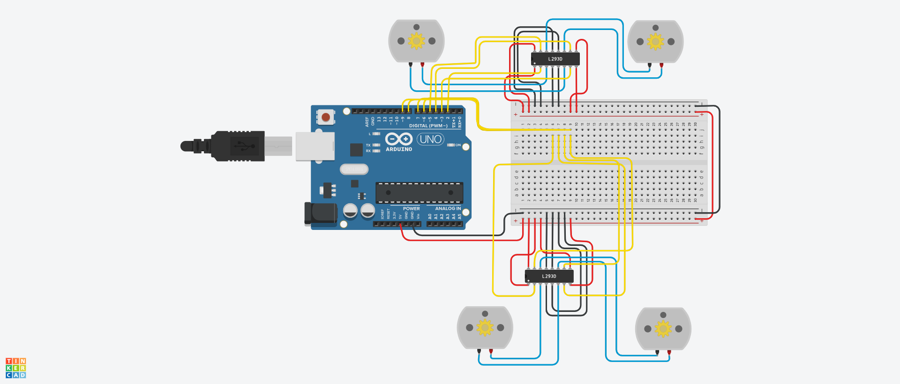

## Task Overview

This project includes two main tasks:

1. **Programming 4 DC Motors with L293D**  
   Controlled 4 DC motors using an Arduino and the L293D motor driver. The program performs sequential movements:  
   - Forward for 30 seconds  
   - Backward for 60 seconds  
   - Alternating left and right for 60 seconds  

2. **Servo Motor and Ultrasonic Sensor Integration**  
   Connected a servo motor and an HC‑SR04 ultrasonic sensor with the L293D motor driver. When an obstacle is detected at a distance of 10 cm or less, the motors stop, and the servo rotates to simulate a direction change before continuing.

---

## Task 1: Programming 4 DC Motors

### Circuit Diagram

> 

### Demo
https://github.com/user-attachments/assets/87f2cd64-6b9b-493f-a48c-f6cae1849b8b


### Arduino Code

```cpp
int motor1_pin1 = 2;
int motor1_pin2 = 3;
int motor2_pin1 = 4;
int motor2_pin2 = 5;
int motor3_pin1 = 6;
int motor3_pin2 = 7;
int motor4_pin1 = 8;
int motor4_pin2 = 9;

void setup() {
  int pins[] = {2,3,4,5,6,7,8,9};
  for (int i=0; i<8; i++) pinMode(pins[i], OUTPUT);
}

void loop() {
  forward();
  delay(30000);

  backward();
  delay(60000);

  unsigned long start = millis();
  while (millis() - start < 60000) {
    turnLeft(); delay(500);
    turnRight(); delay(500);
  }

  stopMotors();
  while (1);
}

void forward() {
  digitalWrite(motor1_pin1, HIGH); digitalWrite(motor1_pin2, LOW);
  digitalWrite(motor2_pin1, HIGH); digitalWrite(motor2_pin2, LOW);
  digitalWrite(motor3_pin1, HIGH); digitalWrite(motor3_pin2, LOW);
  digitalWrite(motor4_pin1, HIGH); digitalWrite(motor4_pin2, LOW);
}

void backward() {
  digitalWrite(motor1_pin1, LOW); digitalWrite(motor1_pin2, HIGH);
  digitalWrite(motor2_pin1, LOW); digitalWrite(motor2_pin2, HIGH);
  digitalWrite(motor3_pin1, LOW); digitalWrite(motor3_pin2, HIGH);
  digitalWrite(motor4_pin1, LOW); digitalWrite(motor4_pin2, HIGH);
}

void turnLeft() {
  digitalWrite(motor1_pin1, LOW); digitalWrite(motor1_pin2, HIGH);
  digitalWrite(motor2_pin1, HIGH); digitalWrite(motor2_pin2, LOW);
  digitalWrite(motor3_pin1, LOW); digitalWrite(motor3_pin2, HIGH);
  digitalWrite(motor4_pin1, HIGH); digitalWrite(motor4_pin2, LOW);
}

void turnRight() {
  digitalWrite(motor1_pin1, HIGH); digitalWrite(motor1_pin2, LOW);
  digitalWrite(motor2_pin1, LOW); digitalWrite(motor2_pin2, HIGH);
  digitalWrite(motor3_pin1, HIGH); digitalWrite(motor3_pin2, LOW);
  digitalWrite(motor4_pin1, LOW); digitalWrite(motor4_pin2, HIGH);
}

void stopMotors() {
  for (int pin=2; pin<=9; pin++) digitalWrite(pin, LOW);
}
```

---
## Task 2: Servo Motor with Ultrasonic Sensor

### Circuit Diagram

> 


### Demo

https://github.com/user-attachments/assets/adf93f43-5318-43e2-a9d8-398186bf0848


```cpp
#include <Servo.h>

Servo myServo;

int motorA1 = 2;
int motorA2 = 3;
int motorB1 = 4;
int motorB2 = 5;
int trigPin = 10;
int echoPin = 11;
long duration;
int distance;

void setup() {
  Serial.begin(9600);
  pinMode(motorA1, OUTPUT);
  pinMode(motorA2, OUTPUT);
  pinMode(motorB1, OUTPUT);
  pinMode(motorB2, OUTPUT);
  pinMode(trigPin, OUTPUT);
  pinMode(echoPin, INPUT);
  myServo.attach(9);
  moveForward();
}

void loop() {
  distance = getFilteredDistance();
  Serial.print("Distance: ");
  Serial.println(distance);

  if (distance > 0 && distance <= 10) {
    Serial.println("Obstacle detected!");
    stopMotors();
    sweepServo();
    moveBackward();
    delay(1000);
    moveForward();
  }
}

void moveForward() {
  digitalWrite(motorA1, HIGH); digitalWrite(motorA2, LOW);
  digitalWrite(motorB1, HIGH); digitalWrite(motorB2, LOW);
}

void moveBackward() {
  digitalWrite(motorA1, LOW); digitalWrite(motorA2, HIGH);
  digitalWrite(motorB1, LOW); digitalWrite(motorB2, HIGH);
}

void stopMotors() {
  digitalWrite(motorA1, LOW); digitalWrite(motorA2, LOW);
  digitalWrite(motorB1, LOW); digitalWrite(motorB2, LOW);
}

void sweepServo() {
  myServo.write(0); delay(300);
  myServo.write(90); delay(300);
  myServo.write(180); delay(300);
}

int getFilteredDistance() {
  long total = 0; int validCount = 0;
  for (int i = 0; i < 5; i++) {
    long d = singleRead();
    if (d > 0 && d < 400) { 
      total += d;
      validCount++;
    }
    delay(10);
  }
  if (validCount == 0) return -1; 
  return total / validCount; 
}

int singleRead() {
  digitalWrite(trigPin, LOW);
  delayMicroseconds(2);
  digitalWrite(trigPin, HIGH);
  delayMicroseconds(10);
  digitalWrite(trigPin, LOW);
  duration = pulseIn(echoPin, HIGH, 30000); 
  return duration * 0.034 / 2;
}
```

---

## Author
**Hassan**  
🌐 [My Website](https://hsnhb.social/)  
🔗 [GitHub](https://github.com/HasanBGIt)  
🔗 [LinkedIn](https://www.linkedin.com/in/hsnhb/)  
