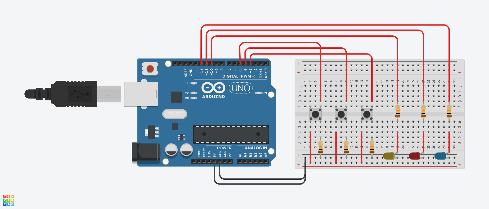

## Task Overview

This project demonstrates how to use an **Arduino** to control **three LEDs** based on input from **three push buttons**. Each button corresponds to one LED, turning it on when pressed and off when released.

---

## Circuit Diagram

>   

---

## Demo Video

> https://github.com/user-attachments/assets/834c5c54-3aba-4731-9be2-ebb4e80fc90e

---


## Arduino Code

```cpp
void setup() {
  pinMode(3, INPUT); 
  pinMode(4, INPUT); 
  pinMode(5, INPUT); 
  pinMode(10, OUTPUT);
  pinMode(11, OUTPUT);
  pinMode(12, OUTPUT);   
}

void loop() {
  
  if (digitalRead(3) == HIGH) {
    digitalWrite(10, HIGH);  
  } else {
    digitalWrite(10, LOW);   
  }
  
  if (digitalRead(4) == HIGH) {
    digitalWrite(11, HIGH);  
  } else {
    digitalWrite(11, LOW);  
  }
  
  if (digitalRead(5) == HIGH) {
    digitalWrite(12, HIGH);  
  } else {
    digitalWrite(12, LOW);  
  }
}
```
---

## Author
**Hassan**  
🌐 [My Website](https://hsnhb.social/)  
🔗 [GitHub](https://github.com/HasanBGIt)  
🔗 [LinkedIn](https://www.linkedin.com/in/hsnhb/)  

