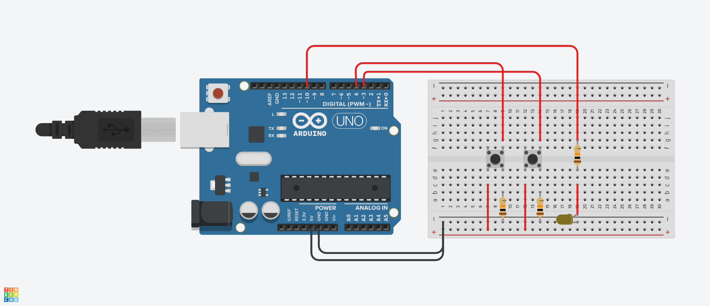
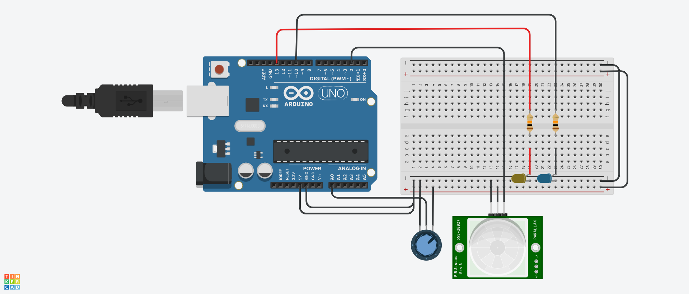

## Task Overview

This project includes two main tasks:

1. **Latching Power Switch with Auto Power ON/OFF**  
   A circuit that emulates flip-flop behavior using pushbuttons and an Arduino, controlling an LED as the output. One button turns the LED on (Set), and the other turns it off (Reset).

2. **Design and Programming of Digital and Analog Sensors**  
   This part involves connecting and reading from a digital PIR motion sensor and an analog potentiometer. The PIR controls an LED (ON when motion is detected), and the potentiometer adjusts the brightness of another LED using PWM.

---

## Task 1: Latching Power Switch Circuit

### Circuit Diagram

> 

### Demo
https://github.com/user-attachments/assets/fd062935-611f-4024-b6fc-b86436d1e8d4

---

### Arduino Code

```cpp
const int setButton = 3;
const int resetButton = 4;
const int outputPin = 10;

bool state = false;

void setup() {
  pinMode(setButton, INPUT);
  pinMode(resetButton, INPUT);
  pinMode(outputPin, OUTPUT);
}

void loop() {
  if (digitalRead(setButton) == HIGH) {
    state = true;
    delay(200);
    while(digitalRead(setButton) == HIGH);
  }

  if (digitalRead(resetButton) == HIGH) {
    state = false;
    delay(200);
    while(digitalRead(resetButton) == HIGH);
  }

  digitalWrite(outputPin, state ? HIGH : LOW);
}
```

---

## Task 2: Digital and Analog Sensor Interface

### Circuit Diagram

> 

### Demo
https://github.com/user-attachments/assets/8e61f63c-4e70-455d-a8ea-a2dcfff5015a

---

### Arduino Code

```cpp
const int pirPin = 2;    
const int ledPin = 13;     
const int potPin = A0;     
const int pwmLed = 10;    

void setup() {
  pinMode(pirPin, INPUT);
  pinMode(ledPin, OUTPUT);
  pinMode(pwmLed, OUTPUT);
  Serial.begin(9600);
}

void loop() {
  int motion = digitalRead(pirPin);
  digitalWrite(ledPin, motion);
  Serial.print("PIR: ");
  Serial.println(motion);

  int potValue = analogRead(potPin); 
  int brightness = map(potValue, 0, 1023, 0, 255);
  analogWrite(pwmLed, brightness);
  Serial.print("Potentiometer: ");
  Serial.println(potValue);

  delay(100);
}

