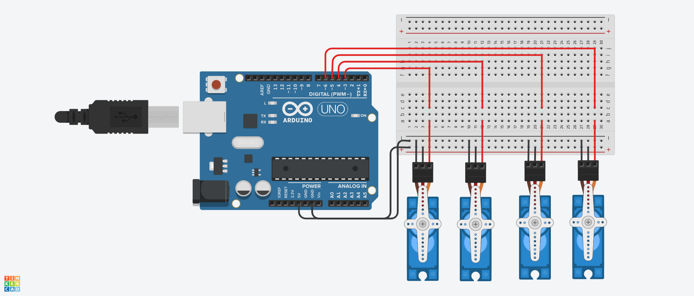

## Task Overview

This project demonstrates how to control **four servo motors** using an **Arduino**. Each servo rotates from 0 to 90 degrees one after another and then returns back to 0 degrees in reverse order, creating a wave-like motion.

---

## Circuit Diagram

> 

---

## Demo Video

> 

---

## Arduino Code

```cpp
#include <Servo.h>

Servo servo_6;
Servo servo_5;
Servo servo_4;
Servo servo_3;

void setup() {
  servo_6.attach(6, 500, 2500);
  servo_5.attach(5, 500, 2500);
  servo_4.attach(4, 500, 2500);
  servo_3.attach(3, 500, 2500);
}

void loop() {
  for (int pos = 0; pos <= 90; pos++) {
    servo_6.write(pos);
    delay(10);
  }

  for (int pos = 0; pos <= 90; pos++) {
    servo_5.write(pos);
    delay(10);
  }

  for (int pos = 0; pos <= 90; pos++) {
    servo_4.write(pos);
    delay(10);
  }

  for (int pos = 0; pos <= 90; pos++) {
    servo_3.write(pos);
    delay(10);
  }

  delay(1);  

  for (int pos = 90; pos >= 0; pos--) {
    servo_3.write(pos);
    delay(10);
  }

  for (int pos = 90; pos >= 0; pos--) {
    servo_4.write(pos);
    delay(10);
  }

  for (int pos = 90; pos >= 0; pos--) {
    servo_5.write(pos);
    delay(10);
  }

  for (int pos = 90; pos >= 0; pos--) {
    servo_6.write(pos);
    delay(10);
  }

  delay(1); 
}
```

---

## Author
**Hassan**  
🌐 [My Website](https://hsnhb.social/)  
🔗 [GitHub](https://github.com/HasanBGIt)  
🔗 [LinkedIn](https://www.linkedin.com/in/hsnhb/)  

