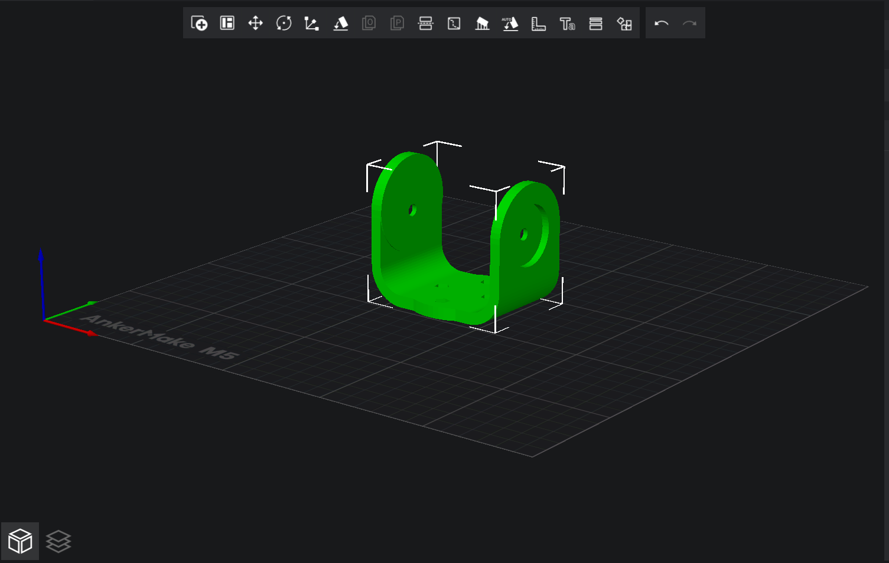
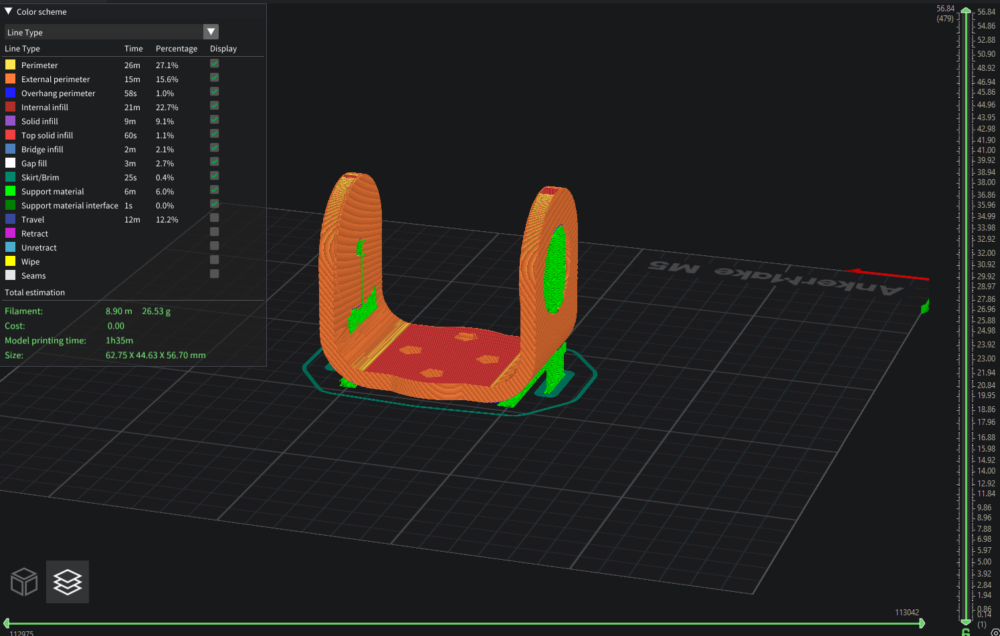
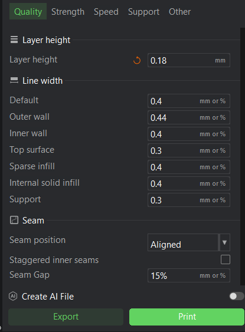
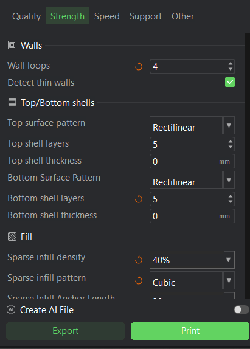
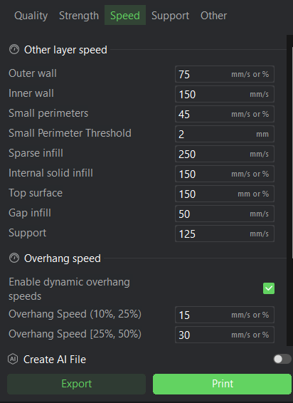
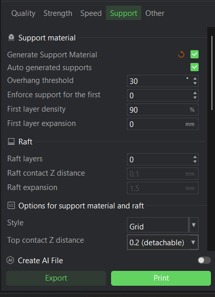

# 3D Printing Optimization for Robotic Arm Joint

## Description

This project presents the redesign and modeling of a **mechanical joint** intended to improve structural strength and durability compared to an initial design.  
The joint was prepared for **3D printing** using Ankermake Studio with carefully optimized slicing settings to balance **strength**, **durability**, and **material efficiency**.  
The part is designed for use as a **robotic arm joint**, which requires high durability and resistance to repeated mechanical stress.

---

## Multiple Viewpoints

To better understand the geometry and modifications of the new joint design, here are various views:

- **Normal View**  
  

- **Overview / Isometric View**  
  

---

## Printing Settings

The joint was sliced in **Ankermake Studio** with the following settings:

- **Layer height:** 0.18 mm → Ensures a balance between smooth surface finish and inter-layer adhesion.
- **Walls:** 4 loops → Provides ~1.6 mm wall thickness for high load-bearing strength.
- **Top/Bottom layers:** 5 layers each → Improves end surface durability and prevents layer separation.
- **Infill:** 40% Cubic → Offers multidirectional strength for torsional and shear forces.
- **Line widths:** Outer wall set to 0.44 mm for improved bonding and strength.
- **Supports:** Auto-generated, 30° overhang threshold, grid contact style.
- **Speeds:** Reduced outer wall speed (75 mm/s) to improve surface quality, higher infill speed for efficiency.

### Quality Settings

### Strength Settings

### Speed Settings

### Support Settings

---

## Why Nylon for the Robotic Arm?

Although PLA shows high "static strength" in charts, it is **brittle** and fails under repeated load or impact, making it unsuitable for moving mechanical parts.  
For a **robotic arm joint** subjected to continuous stress and torque:

- **Nylon** was chosen for its **high toughness**, **flexibility**, and **impact resistance**.  
- It can withstand **repeated motion** without cracking and has superior **chemical resistance** and **wear properties**.
- Compared to ABS or PLA, Nylon is **far more durable** and reliable for functional mechanical parts.

---

## Author

**Hassan**  
🌐 [My Website](https://hsnhb.social/)  
🔗 [GitHub](https://github.com/HasanBGIt)  
🔗 [LinkedIn](https://www.linkedin.com/in/hsnhb/)
