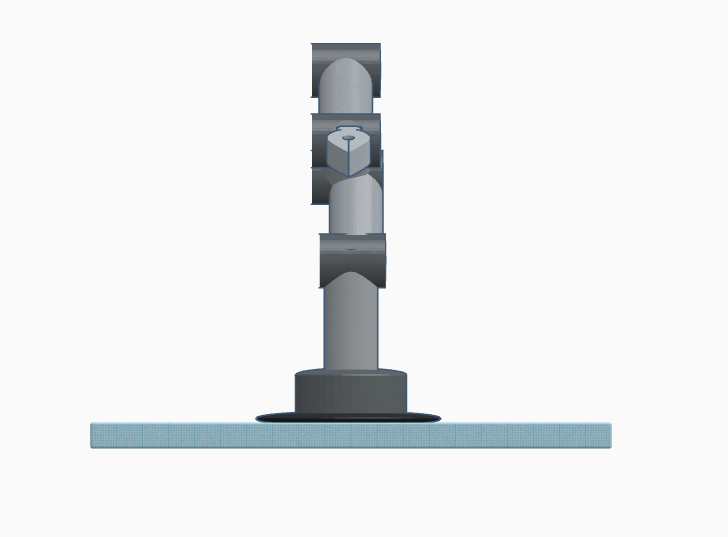
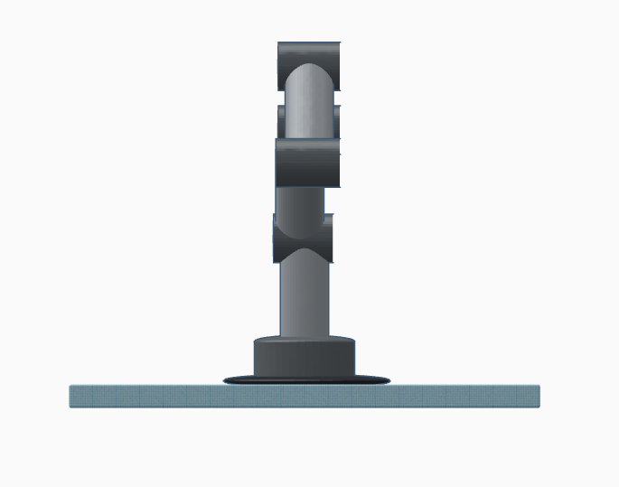
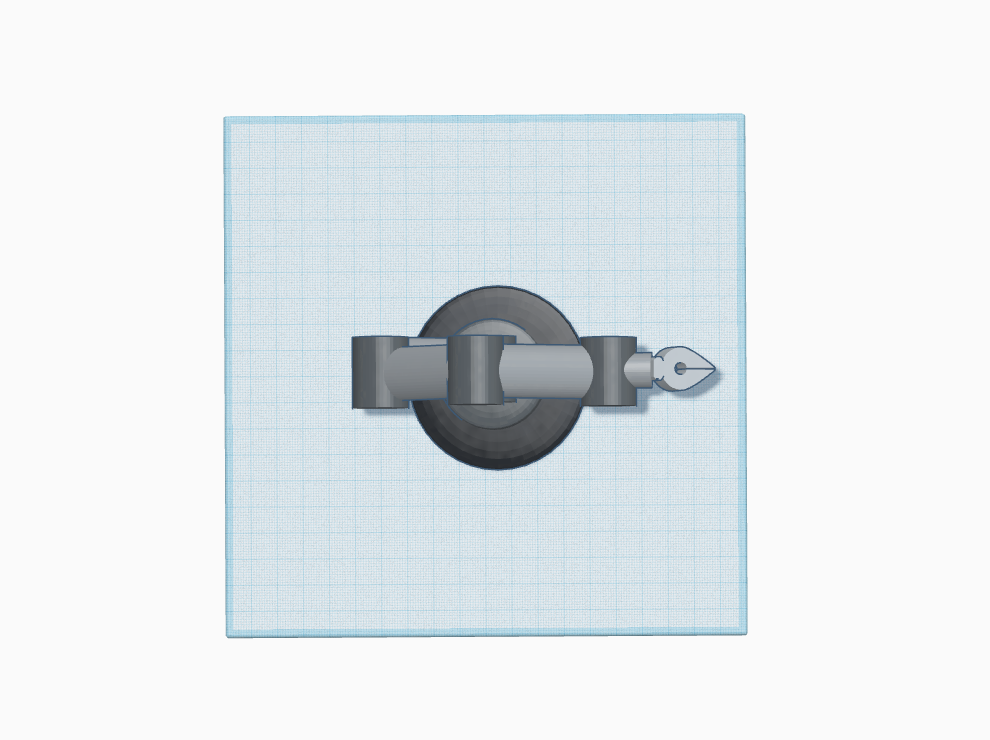
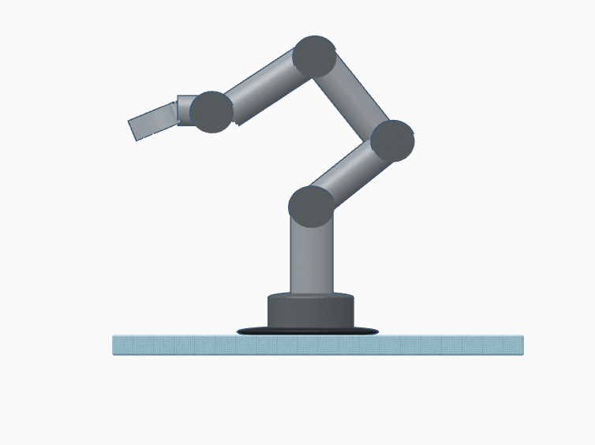
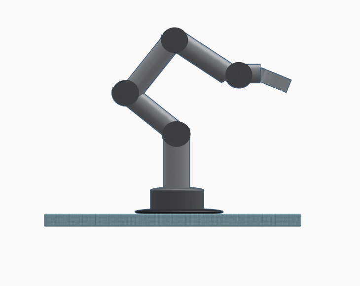
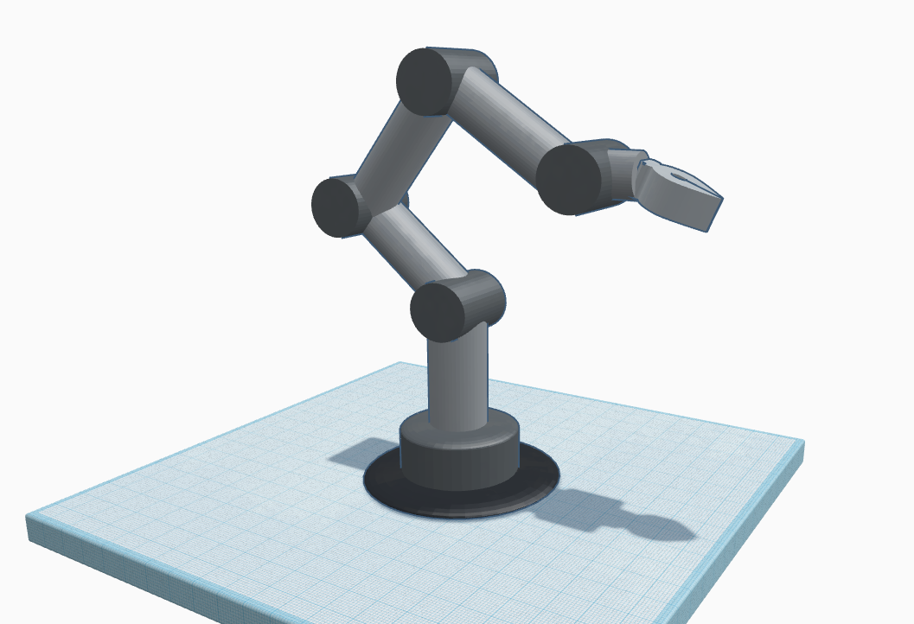
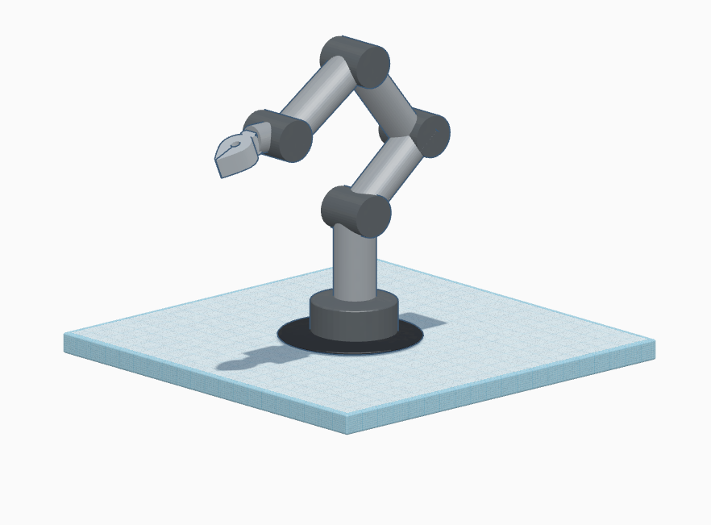

# 3D Robotic Arm Model – 5 Degrees of Freedom (DOF)

## Description

This project involves the design and modeling of a 3D robotic arm with **five degrees of freedom (DOF)**. The robotic arm is designed using CAD tools to simulate realistic movement and articulation, making it suitable for a variety of mechanical and automation-related tasks. The model features rotational joints and a gripper for object interaction.

---

## Features

- **5 DOF articulation**: Base rotation, shoulder, elbow, wrist, and gripper movement.
- **Modular joints**: Each joint is designed to mimic a human arm's flexibility.
- **3D Printable**: Parts are designed with printability in mind.

---

## Multiple Viewpoints

To better understand the geometry and design, here are several views of the model:

- **Front View**  
  

- **Back View**  
  

- **Top View**  
  

- **Left View**  
  

- **Right View**  
  

- **Left-Right View**  
  

- **Right-Left View**  
  

---

## Files Included

- 3D model previews in multiple perspectives.
- TinkerCAD export (`Spectacular Jaagub-Leelo.zip`) containing the full 3D model.
- README file for documentation.

---

## Tools Used

- **TinkerCAD**: For designing the 3D model.
- **Markdown/GitHub**: For project documentation.

---

## Author
**Hassan Barmandah**  
🌐 [My Website](https://hsnhb.social/)  
🔗 [GitHub](https://github.com/HasanBGIt)  
🔗 [LinkedIn](https://www.linkedin.com/in/hsnhb/)  

