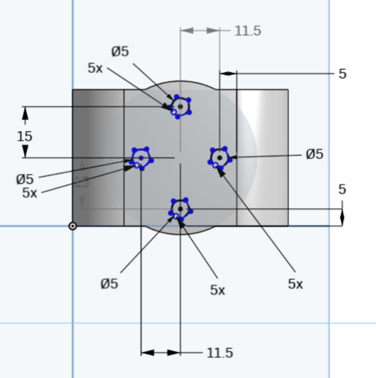
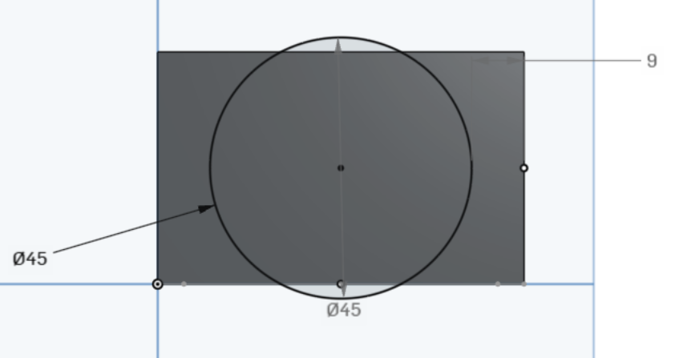

# Mechanical Joint Redesign

## Description

This project presents the redesign and modeling of a **mechanical joint** intended to improve structural strength and durability compared to an initial design.

---

## Multiple Viewpoints

To better understand the geometry and modifications of the new joint design, here are various views:

- **Left View**  
  

- **Overview / Isometric View**  
  

- **Top View**  
  

- **Bottom View**  
  

---

## Dimensional References

The design was guided by key dimensions extracted from technical drawings:

- **Dim1 - Hole layout and spacing**  
  

- **Dim2 - Outer frame and height**  
  

- **Dim3 - Side view and vertical spacing**  
  

- **Dim4 - Circular feature placement**  
  

---

## Files Included

- `The joint.sldprt` – SolidWorks part file.
- `The joint.stl` – Exported file for simulation or 3D printing.
- Viewpoint PNGs and dimension drawings as shown above.

---

## Author

**Hassan**  
🌐 [My Website](https://hsnhb.social/)  
🔗 [GitHub](https://github.com/HasanBGIt)  
🔗 [LinkedIn](https://www.linkedin.com/in/hsnhb/)
