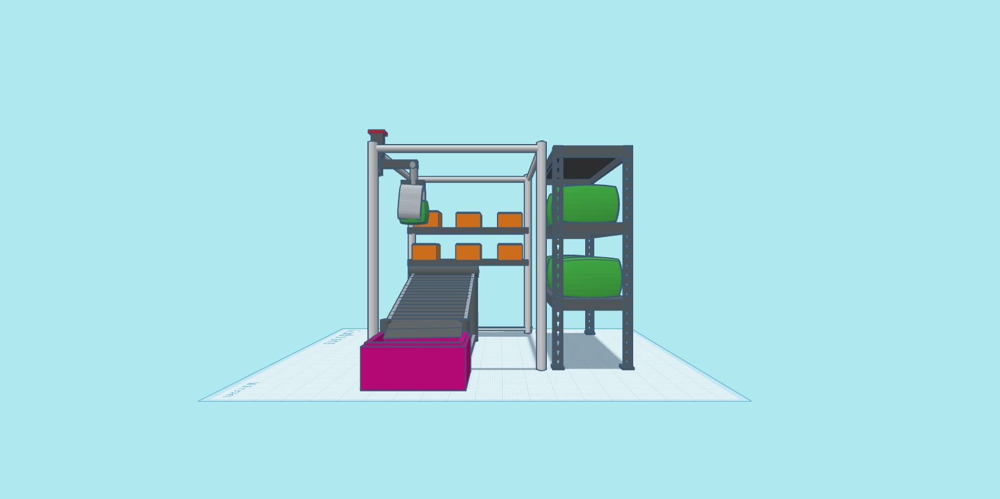
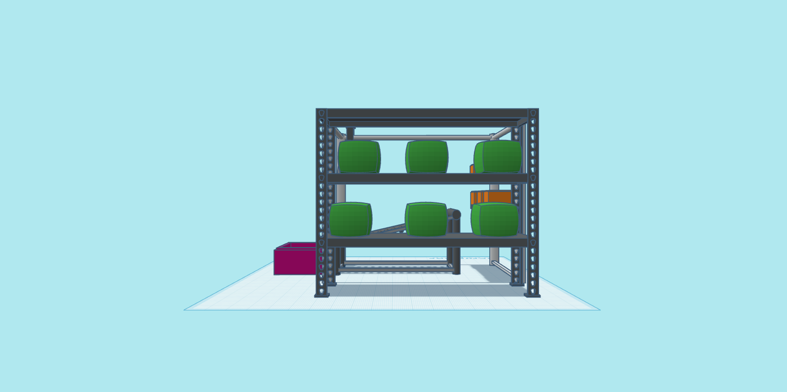
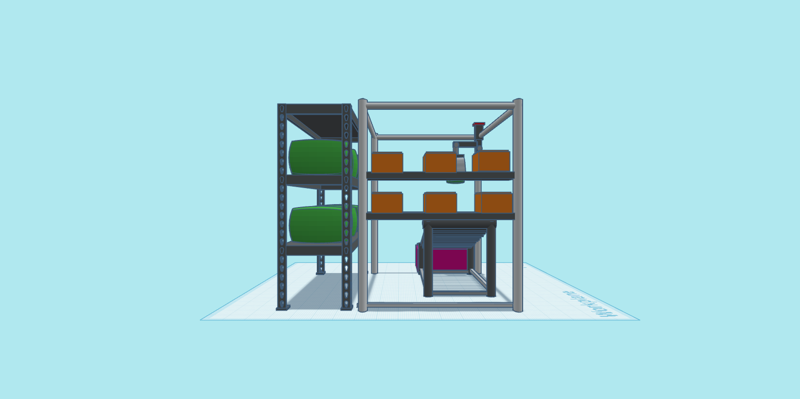
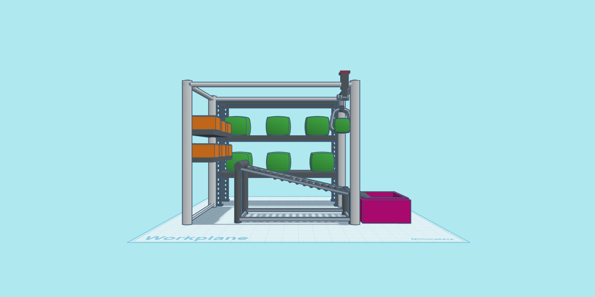
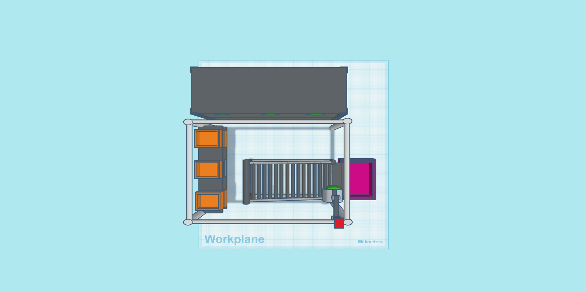

# Food Storage Robot

## Description

This project focuses on designing and modeling an **automated robotic system** to handle food storage operations without any human intervention. The robot is capable of identifying, picking, and placing 
food containers from warehouse shelves onto a conveyor system, which transports them to a storage bin. The solution simulates an intelligent warehouse transformation using mechanical design and automation.

---

## Execution Algorithm

1. Start the system and initialize all components.
2. Scan shelves and detect available containers.
3. Navigate gripper arm to target object position (X, Y, Z).
4. Grab the container using the gripper.
5. Move to the conveyor belt and release the item.
6. Conveyor transfers the item to the pink storage bin.
7. Repeat until all containers are moved.
8. Shut down after completion.

---

## Working Envelope Elements

- **X-Axis Travel**: Horizontal reach across shelf rows.
- **Y-Axis Travel**: Front-to-back movement for gripper alignment.
- **Z-Axis Travel**: Vertical access to 3 shelf levels.
- **Payload**: Suitable for mid-sized boxes and barrels.
- **Conveyor Interface**: Fixed position for item handoff.
- **No rotation required**: Linear movement system.

---

## Multiple Viewpoints

To visualize the robot system and layout, here are various views of the design:

- **Front View**  
  

- **Back View**  
  

- **Left Side View**  
  

- **Right Side View**  
  

- **Top View**  
  

---

## Author

**Hassan**  
🌐 [My Website](https://hsnhb.social/)  
🔗 [GitHub](https://github.com/HasanBGIt)  
🔗 [LinkedIn](https://www.linkedin.com/in/hsnhb/)
