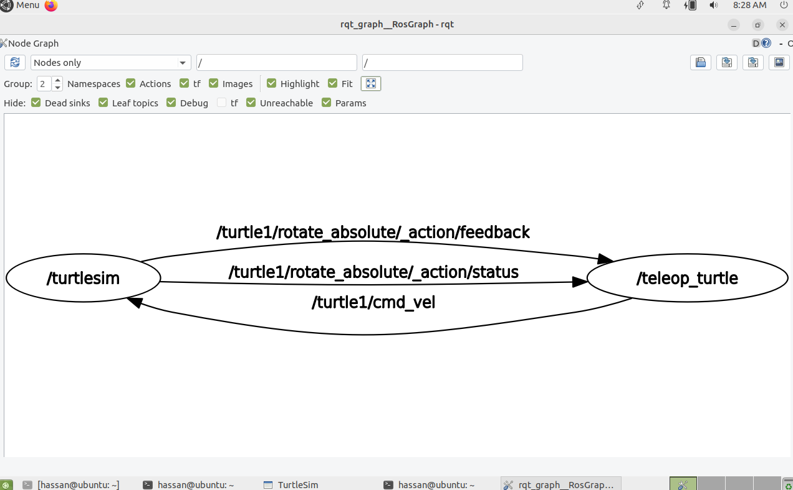
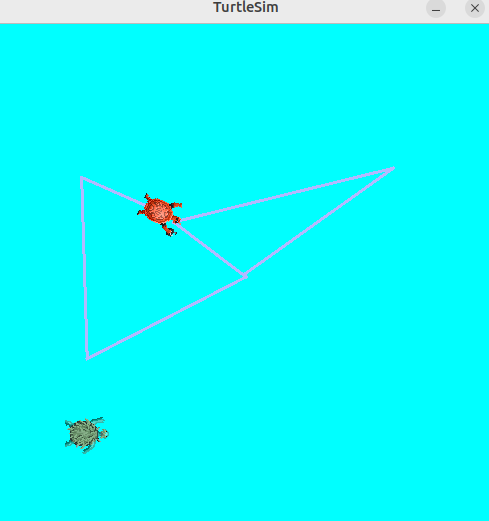
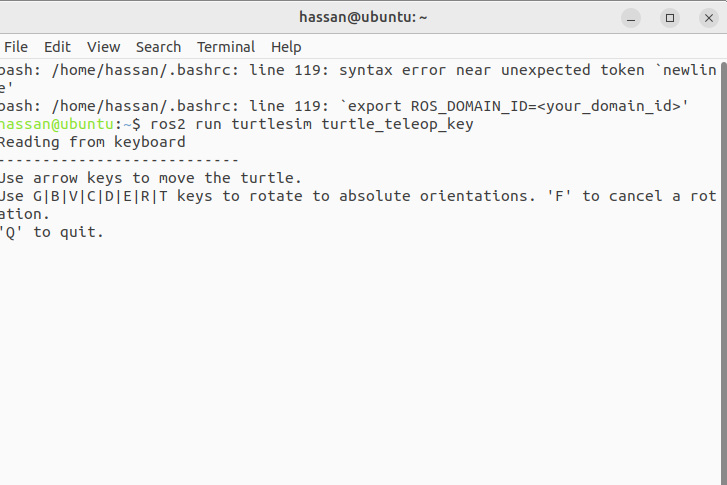
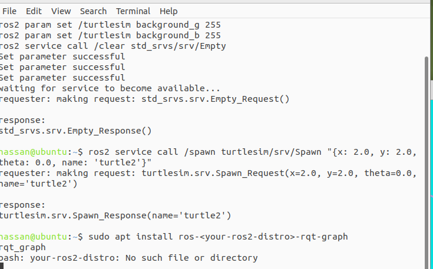

# Task Overview

In this project, I manipulated the **Turtlesim package in ROS2** to explore its parameters, spawn new turtles, control movement via keyboard, and visualize ROS2 nodes and topics using `rqt_graph`.  

---

## Screenshots

- **Graph Visualization**  
  

- **Turtle Simulation**  
  

- **Terminal Commands**  
    
  

---

## 1. Turtlesim Setup & Teleoperation

- Installed and launched the `turtlesim` node.  
- Controlled the turtle using the keyboard with:  
  ```bash
  ros2 run turtlesim turtle_teleop_key
  ```
## 2. Parameter Manipulation
- Changed the background color of the simulation using ROS2 parameters:

```bash
ros2 param set /turtlesim background_g 255
ros2 param set /turtlesim background_b 255
```

## 3. Spawning New Turtles
- Added another turtle at a specific position using:
``` bash
ros2 service call /spawn turtlesim/srv/Spawn "{x: 2.0, y: 2.0, theta: 0.0, name: 'turtle2'}"
```

## 4. Visualizing ROS2 Graph
- Installed and launched rqt_graph to visualize node communication:
```bash
sudo apt install ros-<your-ros2-distro>-rqt-graph
rqt_graph
```

---

## Author
**Hassan**  
🌐 [My Website](https://hsnhb.social/)  
🔗 [GitHub](https://github.com/HasanBGIt)  
🔗 [LinkedIn](https://www.linkedin.com/in/hsnhb/)  
