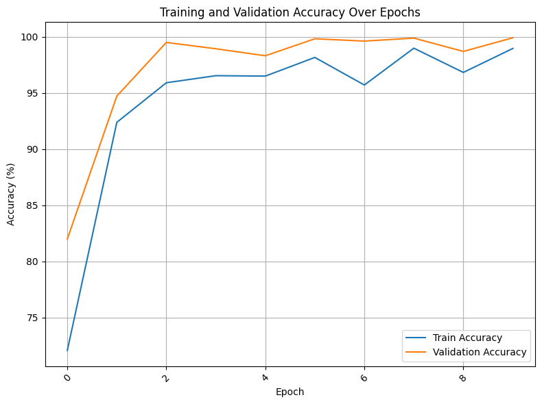

---

## 1. Teachable Machine Model

- Model trained using: [Teachable Machine by Google](https://teachablemachine.withgoogle.com/)
- Exported as `.h5` and `.txt` files

### Accuracy:
> **Teachable Machine Model Accuracy:** `100%` JUST TWO CLASSES,   

---

## 2. EfficientNetB0 Model

- Implemented in Python using Pytorch
- Uses the `EfficientNetB0` 

### Accuracy:
> **EfficientNetB0 Model Accuracy:** `99.91%` for 33 Claasses

---

## Author
**Hassan**  
🌐 [My Website](https://hsnhb.social/)  
🔗 [GitHub](https://github.com/HasanBGIt)  
🔗 [LinkedIn](https://www.linkedin.com/in/hsnhb/)  
