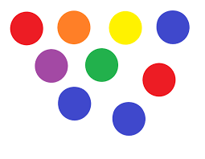

# Task Overview

In this repository, I have completed four different projects using OpenCV for various computer vision tasks. Each project focuses on one specific problem and demonstrates how OpenCV can be used to solve it effectively. Below are the details of each project:

---

## 1. Face Recognition Project (Using OpenCV)

- Implemented in Python using OpenCV for Face Recognition
- Detects faces in an image using pre-trained models.

### Input:

### Output:

---

## 2. Line Tracking Project (Using OpenCV)

- Implemented in Python using OpenCV for Line Tracking
- Tracks specific lines in a video feed.

### Input:

### Output:

---

## 3. Object Tracking Project (Using OpenCV)

- Implemented in Python using OpenCV for Object Tracking
- Tracks objects in a video based on predefined colors or shapes.

### Input:
https://github.com/user-attachments/assets/42b338e4-46a2-41fb-8e39-bfb715c46555

### Output:
https://github.com/user-attachments/assets/63085075-bd86-4e12-ba60-7e47678aac99

---

## 4. Color Recognition Project (Using OpenCV)

- Implemented in Python using OpenCV for Color Recognition
- Detects specific colors within an image and highlights them.

### Input:

### Output:

---

## Author
**Your Name**  
🌐 [Your Website](https://yourwebsite.com)  
🔗 [GitHub](https://github.com/yourgithub)  
🔗 [LinkedIn](https://www.linkedin.com/in/yourlinkedin/)
