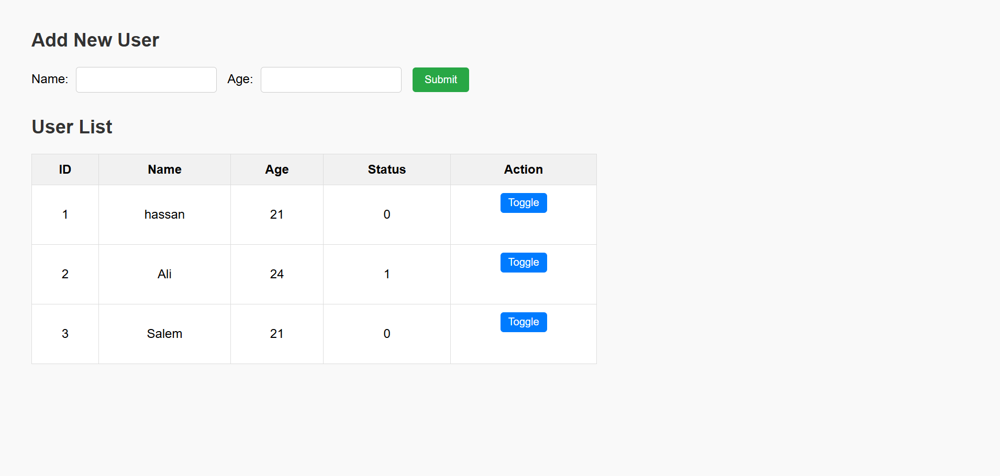
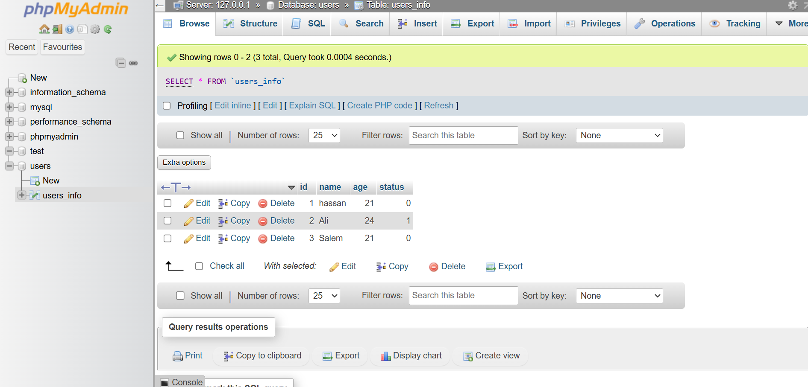

## Task Description

The goal of this task is to **create a dynamic user management webpage** using HTML, CSS, JavaScript, PHP, and MySQL. This page allows users to input personal data (name and age), view the existing user list, and toggle the user’s status between `0` and `1`. All data is stored and managed via a MySQL database. The project files are well-structured, and the functionality is demonstrated in the previews below.

---

## Website Previews

### User Form and Table Interface  
A responsive webpage with a simple form to add users and a table that displays all user records from the database. Each row has a toggle button to update the user status immediately.

---

### MySQL Database View  
A screenshot of the `users_info` table inside phpMyAdmin, showing stored user records and their respective status.

---

## Author
**Hassan**  
🌐 [My Website](https://hsnhb.social/)  
🔗 [GitHub](https://github.com/HasanBGIt)  
🔗 [LinkedIn](https://www.linkedin.com/in/hsnhb/)  

